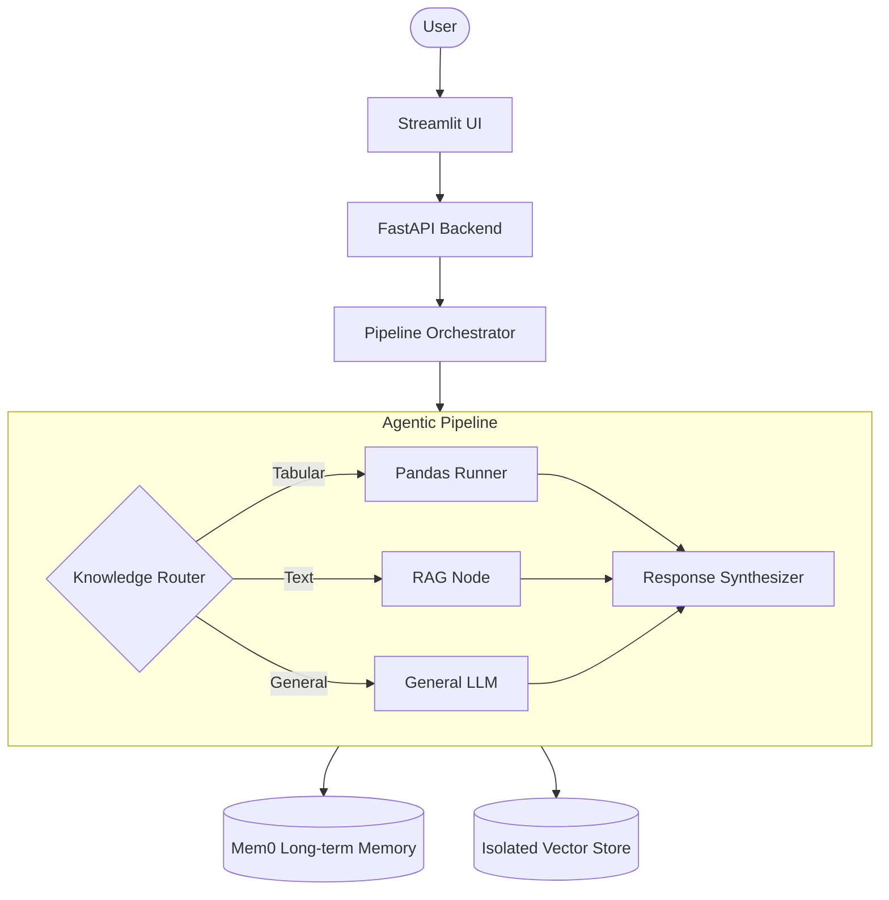

# 📊 Multi-Agent Data Analyst

An advanced agentic pipeline designed to analyze various data sources (Tabular & Textual) using a coordinated multi-agent system powered by **LangGraph**, **LlamaIndex**, and **Mem0**.

## 🚀 Overview

This system allows users to upload datasets (CSV/Excel) and documents (PDF/Docx), then perform complex conversational analysis. It features an intelligent router that dynamically dispatches tasks to specialized agents:

- **Pandas Agent**: For statistical analysis and data visualization.
- **RAG Agent**: For precise information retrieval from documents.
- **Long-term Memory**: Powered by Mem0 to remember user preferences and facts across sessions.

## ✨ Key Features

- **Multi-Source Data Ingestion**: Seamlessly process structured tables and unstructured documents.
- **Advanced RAG Pipeline**: Uses **Hierarchical Auto-Merging Retrieval** for superior context extraction.
- **Dynamic Routing**: Automatically decides whether to use a tabular engine, RAG, or general AI knowledge.
- **Isolated Storage**: Collection-level isolation to prevent data corruption between different datasets.
- **Interactive Visualization**: Generates charts and plots based on data queries.
- **User Personalization**: Learns from previous interactions to provide more relevant insights.

## 🏗 Architecture



## 🛠 Tech Stack

- **Framework**: [LangGraph](https://github.com/langchain-ai/langgraph)
- **RAG Engine**: [LlamaIndex](https://www.llamainindex.ai/)
- **Large Language Models**: Google Gemini 2.5 Flash / Ollama
- **Memory**: [Mem0](https://mem0.ai/)
- **Vector Database**: Qdrant
- **Backend**: FastAPI
- **Frontend**: Streamlit

## 📁 Project Structure

```text
├── .github/          # GitHub Actions CI/CD workflows
├── config/           # Configuration files (YAML format)
├── data/             # Raw datasets and test data
├── logs/             # Application execution logs
├── notebooks/        # Jupyter notebooks for experimentation and analysis
├── src/              # Core application source code
│   ├── agents/       # LangGraph nodes and agent components
│   ├── api/          # FastAPI backend server
│   ├── core/         # Orchestrator and global configurations
│   ├── llm/          # LLM integrations (Gemini, Ollama, Embeddings)
│   ├── memory/       # Mem0 long-term memory integration
│   ├── processors/   # Document processing and chunking (PDF, Word)
│   ├── prompt/       # LLM prompt templates
│   ├── retrieval/    # RAG engines and vector DB managers
│   ├── ui/           # Streamlit frontend application
│   └── utils/        # Shared utilities like logging
├── storage/          # Local persistent storage (Mem0, VectorDBs, Parquets)
└── tests/            # Unit, integration, and end-to-end tests
```

## 🚦 Getting Started

### Prerequisites

- Python 3.10+
- Virtual environment (recommended)
- API Keys for Google Gemini (optional if using Ollama)

### Installation

1. Clone the repository:
   ```bash
   git clone <repo-url>
   cd Multi-Agent-Data-Analyst
   ```
2. Create and activate virtual environment:
   ```bash
   python -m venv venv
   .\venv\Scripts\Activate.ps1
   ```
3. Install dependencies:
   ```bash
   pip install -r requirements.txt
   ```

### Running the Application

1. Start the Backend API:
   ```bash
   python -m src.api.main
   ```
2. Start the Streamlit UI:
   ```bash
   streamlit run src/ui/app.py
   ```

## 🧪 Testing

We provide a comprehensive end-to-end test script:

```bash
python run_final_test.py
```

This script verifies:

- Data Ingestion for both CSV and PDF.
- Correct routing to specialized agents.
- Successful context retrieval and chart generation.

## 📄 License

This project is licensed under the MIT License.
