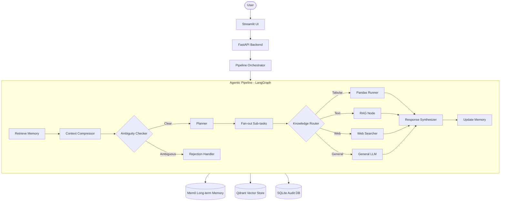

# 📊 Multi-Agent Data Analyst

An advanced agentic pipeline designed to analyze various data sources (Tabular & Textual) using a coordinated multi-agent system powered by **LangGraph**, **LlamaIndex**, and **Mem0**.

## 🚀 Overview

This system allows users to upload datasets (CSV/Excel) and documents (PDF/Docx), then perform complex conversational analysis. It features an intelligent router that dynamically dispatches tasks to specialized agents:

- **Pandas Agent**: For statistical analysis and data visualization.
- **RAG Agent**: For precise information retrieval from documents.
- **Web Search Agent**: For real-time information from the internet via Tavily.
- **Long-term Memory**: Powered by Mem0 to remember user preferences and facts across sessions.
- **SQL Persistence Layer**: Tracks users, datasets, chat sessions, messages, and agent execution logs.

## ✨ Key Features

- **Multi-Source Data Ingestion**: Seamlessly process structured tables (CSV/Excel) and unstructured documents (PDF/DOCX).
- **Advanced RAG Pipeline**: Supports two retrieval strategies:
  - **Hierarchical Auto-Merging Retrieval**: Traverses parent → child node trees for high-precision document context.
  - **Hybrid Search**: Combines dense vector search with BM25 keyword search for broader coverage.
- **Dynamic Routing**: Automatically decides whether to use a tabular engine, RAG, web search, or general AI knowledge.
- **HyDE Query Expansion**: Generates a hypothetical document to improve semantic search accuracy before retrieval.
- **Isolated Storage**: Collection-level isolation in Qdrant to prevent data corruption between different datasets.
- **Interactive Visualization**: Generates charts and plots based on data queries, displayed directly in chat.
- **User Personalization**: Learns user identity, preferences, and goals via Mem0 long-term memory (per-user, per-provider).
- **Full Observability**: LangSmith tracing for every agent run, plus SQLite-backed audit logs.
- **Premium Streamlit UI**: Dark glassmorphism interface with live provider switching and memory management.

## 🏗 Architecture



## 🛠 Tech Stack

| Category | Technology |
|---|---|
| **Orchestration** | [LangGraph](https://github.com/langchain-ai/langgraph) |
| **RAG Engine** | [LlamaIndex](https://www.llamaindex.ai/) |
| **LLM (Cloud)** | Google Gemini 2.5 Flash |
| **LLM (Local)** | [Ollama](https://ollama.com/) (Qwen3:8b, nomic-embed-text) |
| **Memory** | [Mem0](https://mem0.ai/) + ChromaDB |
| **Vector Database** | [Qdrant](https://qdrant.tech/) (local) |
| **Reranker** | BAAI/bge-reranker-v2-m3 |
| **Web Search** | [Tavily API](https://tavily.com/) |
| **SQL Persistence** | SQLite + SQLAlchemy |
| **Backend** | FastAPI |
| **Frontend** | Streamlit |
| **Observability** | [LangSmith](https://smith.langchain.com/) |

## 📁 Project Structure

```text
├── config/           # Configuration files (YAML format)
│   └── setting.yaml  # Main config: providers, chunking, retrieval params
├── data/             # Raw datasets and test data
├── logs/             # Application execution logs
├── src/              # Core application source code
│   ├── agents/       # LangGraph nodes, state, graph topology, memory nodes
│   ├── api/          # FastAPI backend server (endpoints, schemas)
│   ├── core/         # Orchestrator, global configurations, Pydantic settings
│   ├── db/           # SQLAlchemy models, DatabaseManager, CRUD helpers
│   ├── llm/          # LLM factory, embeddings (Gemini & Ollama)
│   ├── memory/       # LongTermMemoryManager (Mem0 OOP wrapper)
│   ├── processors/   # Document processing and chunking (PDF, Word)
│   ├── prompt/       # All LLM prompt templates
│   ├── retrieval/    # VectorDBManager (Qdrant), hierarchical & hybrid retrieval
│   ├── ui/           # Streamlit frontend (glassmorphism dark theme)
│   └── utils/        # Shared utilities (logging)
├── storage/          # Local persistent storage (Mem0 ChromaDB, Qdrant, SQLite)
└── requirements.txt  # Python dependencies
```

## 🗄 Database Schema

The SQL persistence layer (SQLite via SQLAlchemy) tracks full system state:

| Table | Description |
|---|---|
| `users` | Registered user profiles |
| `datasets` | Uploaded files with metadata (type, path, provider) |
| `chat_sessions` | Conversation sessions linked to users and datasets |
| `messages` | Individual chat messages (user/assistant) per session |
| `agent_runs` | Execution logs for each LangGraph node (latency, status) |

## 🚦 Getting Started

### Prerequisites

- Python 3.10+
- Virtual environment (recommended)
- [Qdrant](https://qdrant.tech/documentation/quickstart/) running locally (default: `localhost:6333`)
- API Keys: `GOOGLE_API_KEY`, `TAVILY_API_KEY`, `LANGSMITH_API_KEY`
- *(Optional)* [Ollama](https://ollama.com/) for fully local inference

### Installation

1. Clone the repository:
   ```bash
   git clone https://github.com/HoangKhang226/Multi-Agent-Data-Analyst.git
   cd Multi-Agent-Data-Analyst
   ```
2. Create and activate virtual environment:
   ```bash
   python -m venv venv
   # Windows
   .\venv\Scripts\Activate.ps1
   # macOS / Linux
   source venv/bin/activate
   ```
3. Install dependencies:
   ```bash
   pip install -r requirements.txt
   ```
4. Configure environment variables — create a `.env` file at the project root:
   ```env
   GOOGLE_API_KEY=your_google_api_key
   TAVILY_API_KEY=your_tavily_api_key
   LANGSMITH_API_KEY=your_langsmith_api_key
   ```
5. *(Optional)* Edit `config/setting.yaml` to switch providers, tune chunking params, or change retrieval thresholds.

### Running the Application

1. Start Qdrant (if not already running):
   ```bash
   docker run -p 6333:6333 qdrant/qdrant
   ```
2. Start the Backend API:
   ```bash
   python -m src.api.main
   ```
3. Start the Streamlit UI (in a separate terminal):
   ```bash
   streamlit run src/ui/app.py
   ```
4. Open your browser at `http://localhost:8501`.

### Ollama (Local Mode)

To run fully offline without Google API keys:

1. Install and start Ollama: https://ollama.com/download
2. Pull the required models:
   ```bash
   ollama pull qwen3:8b
   ollama pull nomic-embed-text
   ```
3. In `config/setting.yaml`, set:
   ```yaml
   graph_provider: ollama
   memory_provider: ollama
   ```

## ⚙️ Configuration Reference

Key settings in `config/setting.yaml`:

| Key | Description | Default |
|---|---|---|
| `graph_provider` | LLM backend for the agent pipeline | `gemini` |
| `memory_provider` | Backend for Mem0 memory | `gemini` |
| `retrieval.top_k` | Number of chunks retrieved per query | `5` |
| `retrieval.threshold` | Minimum similarity score for retrieval | `0.7` |
| `chunking.parent_chunk_size` | Token size for parent nodes in hierarchical RAG | `1024` |
| `chunking.child_chunk_size` | Token size for child nodes | `256` |
| `database.url` | SQLAlchemy connection string | `sqlite:///storage/app.db` |
| `memory.chroma_path` | Path for Mem0's ChromaDB vector store | `storage/mem0_chroma` |

## 🧪 Testing

Run the integration test suite to verify database operations:

```bash
python -m pytest tests/integration/ -v
```

Key integration tests:

| Test | What it verifies |
|---|---|
| `test_db_manager.py` | E2E flow: Ingestion → Chat → Agent logging |
| `test_db_crud.py` | CRUD operations for all database tables |

## 🔭 Observability

Every agent run is tracked via **LangSmith**. Configure your `LANGSMITH_API_KEY` and `LANGSMITH_PROJECT` in `.env` to see:

- Full execution traces for each LangGraph node
- Token usage per LLM call
- Latency breakdown across the pipeline
- Memory retrieval and update events

## 📄 License

This project is licensed under the MIT License.
